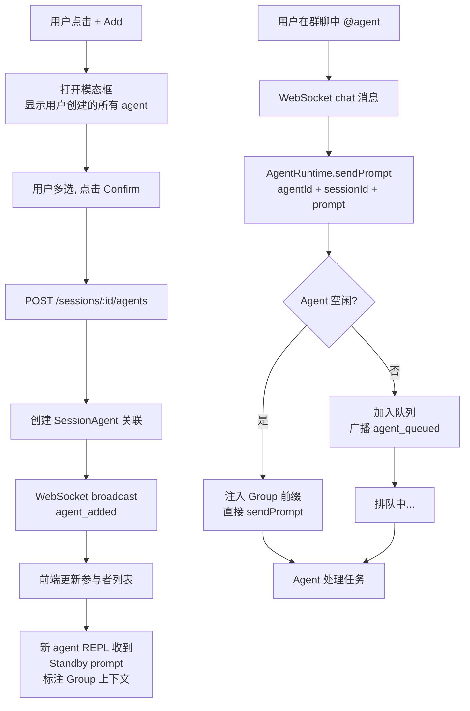

# Agent 生命周期重构设计文档

> **日期**：2026-05-29
> **目标**：将 Agent 从 session-scoped 进程重构为全局实体，支持独立容器 + 记忆共享 + Solo/Group 隔离与联动

---

## 1. 目标与背景

### 当前问题

- Agent 是 session-scoped 进程，不存在于 session 之外
- Solo 和 Group 的 Agent 相互不可见，@ 机制可以拉任何 agent 进群
- Agent 记忆（`.claude/memory/`）丢弃在 session 沙箱中，session 销毁后丢失
- 用户创建的个性化 agent 不能同时出现在 solo 和 group 中

### 重构目标

- Agent 成为**全局实体**，有自己的独立容器和常驻 REPL 进程
- Solo 创建的 agent 可被**邀请**加入 group，共享同一实例（非复制）
- Agent 记忆在 solo/group 之间**双向同步**
- Group 通过 UI 按钮管理成员（添加/移除），不通过 @ 拉非群成员
- 系统默认 agent（Planner/CodeAgent/ReviewAgent）per-group 实例化，用户 agent 全局共享

---

## 2. 架构设计

### 2.1 Agent 类型分层

```
🔵 用户创建 Agent
   全局唯一，独立容器，跨 session 共享记忆
   可被邀请加入任意 group
   例: "Python导师"、"我的前端专家"、"笑话大师"

🟢 系统默认 Agent
   Per-group 实例，从模板初始化（clone）
   不共享记忆，group 间完全隔离
   命名: {agentName}-{groupIdShort}
   例: "planner-ab12cd34"、"code-agent-ef56gh78"
```

### 2.2 容器模型

```
每 Agent 独立 Docker 容器
├── 容器名: agenthub-agent-{agentId}
├── 内存限制: 1GB（可配置）
├── 宿主 volume: /var/agenthub/agents/{agentId}/
│   ├── CLAUDE.md          ← Agent 系统 prompt + 身份定义
│   ├── .claude/
│   │   ├── memory/        ← 长期记忆持久化
│   │   ├── skills/        ← Agent 专属技能
│   │   └── settings.json  ← Agent 配置
│   └── workspace/         ← Agent 专属工作区
└── REPL 进程: 常驻 Claude Code SDK session
```

### 2.3 并发模型

Agent 的 REPL 进程是单线程的。多个 session 同时调用同一个 agent 时，使用**排队模式**：

```
Agent1 REPL:
  [solo-session-A] 执行中...
  [group-session-B] 排队 #1
  [group-session-C] 排队 #2

前端显示: "Agent 正在处理其他任务，排在队列第 X 位"
```

### 2.4 记忆同步模型

Agent 始终知道当前上下文模式，由其 CLAUDE.md 规则自行判断什么该记住：

```
代理提供商不需要额外加入任何系统prompt，因为角色自带systemPrompt由初始化agent创建时注入即可

Solo 模式: 
 上下文开头注入: "[Solo - 与用户一对一交流]"
 行为: 关注用户偏好，记住所有重要决定

Group 模式: 
 上下文开头注入: "[Group - 多Agent协作]"
 行为: 只关注任务本身，不记群聊闲聊
```

### 2.5 会话上下文前缀注入

每次sendPrompt时由chat逻辑判断当前agent在solo还是group，动态注入前缀

```typescript
// 伪代码
function buildAgentPrompt(agentId, sessionId, taskPrompt) {
  const session = getSession(sessionId);
  const mode = session.type === 'solo' ? 'solo' : 'group';
  
  const prefix = mode === 'solo' 
    ? '[Solo - 与用户一对一交流]'
    : '[Group - 多Agent协作]';
    
  return `${prefix}\n\n${taskPrompt}`;
}
```

不需要在agent启动时固化，每次sendPrompt动态判断

---

## 3. 数据模型变更

### 3.1 Prisma Schema

```prisma
model Agent {
  id              String         @id @default(uuid())
  name            String         @unique
  displayName     String
  description     String
  systemPrompt    String
  provider        String         @default("claude-code")
  providerConfig  Json?
  capabilities    Json?
  isActive        Boolean        @default(true)
  
  // NEW fields
  type            String         @default("user")    // "user" | "system"
  templateId      String?                             // 指向模板 agent 的 ID（system agent 特有）
  contextMode     String         @default("shared")  // "shared" | "isolated"
  containerId     String?                             // Docker 容器 ID
  containerStatus String         @default("stopped") // "stopped" | "running" | "error"
  hostWorkDir     String?                             // 宿主工作目录路径
  createdBy       String?                             // 创建者 userId
  
  sessionAgents   SessionAgent[]
  createdAt       DateTime       @default(now())
  updatedAt       DateTime       @updatedAt
}

model SessionAgent {
  id                   String  @id @default(uuid())
  sessionId            String
  agentId              String
  systemPromptOverride String? // 保留 session 级 prompt 覆盖（用于 group 中微调）
  session              Session @relation(fields: [sessionId], references: [id], onDelete: Cascade)
  agent                Agent   @relation(fields: [agentId], references: [id], onDelete: Cascade)
  
  @@unique([sessionId, agentId])
}
```

### 3.2 Agent 模板表（新增）

```prisma
model AgentTemplate {
  id           String  @id @default(uuid())
  name         String  @unique   // "planner", "code-agent", "review-agent"
  displayName  String
  description  String
  systemPrompt String
  provider     String  @default("claude-code")
  
  // 从模板创建的 agent 实例
  instances    Agent[] @relation("TemplateInstances")
}
```

模板用于创建 group 中的系统 agent 实例。当前模板：
- `planner` - 任务规划器
- `code-agent` - 代码生成/编辑
- `review-agent` - 代码审查
- `test-agent` - 测试生成

---

## 4. 核心模块设计

### 4.1 AgentRuntime（新模块）

```typescript
// apps/api/src/agent/AgentRuntime.ts

class AgentRuntime {
  private agentProcesses: Map<string, AbstractProvider>;   // agentId → provider
  private agentQueues: Map<string, TaskQueueItem[]>;        // agentId → 排队队列
  private agentContainers: Map<string, string>;             // agentId → containerId
  private agentCurrentSession: Map<string, string>;         // agentId → 当前活跃 sessionId

  /** 向 agent 发送 prompt，如果忙碌则排队 */
  async sendPrompt(agentId: string, sessionId: string, prompt: string): Promise<void>;
  
  /** 启动 agent 容器和 REPL 进程（惰性） */
  private async ensureRunning(agentId: string): Promise<void>;
  
  /** 停止 agent 容器（空闲超时触发） */
  async stopContainer(agentId: string): Promise<void>;
  
  /** 获取 agent 的队列状态 */
  getQueueStatus(agentId: string): { pending: number; currentSession?: string };
  
  /** 注册 REPL 事件处理器 */
  private registerHandler(agentId: string, sessionId: string, provider: AbstractProvider): void;
}
```

**sendPrompt 逻辑：**
1. 如果 agent 不在 `agentProcesses` → 启动容器 → `ensureRunning()`
2. 如果 agent 正在处理其他 session → 加入队列
3. 如果 agent 空闲 → 直接 sendPrompt
4. Agent done → 检查队列 → 处理下一个
5. Agent done + 队列空 → 启动空闲倒计时（30min 后 stopContainer）

### 4.2 Session 创建逻辑变更

```typescript
// apps/api/src/routes/sessions.ts

async function createGroupSession(data) {
  // 1. 用户选择的 agent 加入 group（用户 agent）
  for (const agentId of data.agentIds) {
    await prisma.sessionAgent.create({ sessionId, agentId });
    // 这些 agent 是"邀请"关系，共享实例
  }
  
  // 2. 自动创建系统 agent 实例（从模板 clone）
  const templates = await prisma.agentTemplate.findMany();
  for (const tpl of templates) {
    if (!data.excludeTemplates?.includes(tpl.name)) {
      const systemAgent = await cloneFromTemplate(tpl, sessionId);
      await prisma.sessionAgent.create({ sessionId, agentId: systemAgent.id });
    }
  }
}

async function cloneFromTemplate(tpl, sessionId) {
  return prisma.agent.create({
    data: {
      name: `${tpl.name}-${sessionId.slice(0, 8)}`,
      displayName: tpl.displayName,
      description: tpl.description,
      systemPrompt: tpl.systemPrompt,
      type: 'system',
      templateId: tpl.id,
      contextMode: 'isolated', // 系统 agent 不共享记忆
    }
  });
}
```

### 4.3 Solo Session 创建逻辑

```typescript
async function createSoloSession(data) {
  const session = await prisma.session.create({ type: 'solo', ... });
  
  if (data.customAgent) {
    // 用户创建自定义 agent → 全局唯一用户 agent
    const agent = await prisma.agent.create({
      data: {
        ...data.customAgent,
        type: 'user',
        contextMode: 'shared',  // 用户 agent 跨 session 共享
        createdBy: userId,
      }
    });
    await prisma.sessionAgent.create({ sessionId, agentId: agent.id });
  } else {
    // 默认使用 code-agent（用户创建自己的 code-agent 实例）
    // 首次 → create。后续 → 复用已有
    let agent = await prisma.agent.findFirst({ 
      where: { name: 'code-agent', type: 'user', createdBy: userId } 
    });
    if (!agent) {
      agent = await cloneFromTemplate(codeTemplate, sessionId); 
    }
    await prisma.sessionAgent.create({ sessionId, agentId: agent.id });
  }
  
  return session;
}
```

### 4.4 Solo 和 Group 的 @ 行为变更

```
Solo session:
  @ 弹窗 → 显示用户创建的所有 agent + 当前 session 的 agent
  不显示 group 中的系统 agent（isolated 类型）

Group session:  
  @ 弹窗 → 仅显示当前 group 的 SessionAgent 列表
  不从全局 agent 池搜索
  添加成员通过 [+ Add] 按钮 → 弹出模态框 → 显示用户创建的所有 agent
```

### 4.5 Add/Remove Member API

```typescript
// POST /api/sessions/:sessionId/agents — 添加 agent 到 group
// Body: { agentIds: string[] }
// 校验: agent 必须 type='user' 且 createdBy = userId（用户只能添加自己的 agent）

// DELETE /api/sessions/:sessionId/agents/:agentId — 从 group 移除 agent
// 不删除 agent 实例，只移除关联
```

---

## 5. 前端 UI 变更

### 5.1 Group Session Header

```
┌─ Session Header ──────────────────────────────────────────────────┐
│  [+ Add] [− Rmv]  Group Session  Participants: You, C, R  [Trust▼] [⚙] │
└───────────────────────────────────────────────��───────────────────┘
```

### 5.2 Add Agent 模态框

- 显示用户创建的所有 type='user' 的 agent（排除已在群内的）
- 支持搜索过滤
- 支持多选
- 底部显示选中数量和确认按钮

### 5.3 Remove Agent 模态框

- 显示当前群内的 agent（系统 agent 和用户 agent 均可移除）
- hover 显示移除按钮
- 乐观更新，立即生效

### 5.4 Solo Session 左侧 Agent 列表

- 显示用户创建的所有 agent（type='user' + createdBy = 当前用户）
- 点击某个 agent 进入该 agent 专属的 solo 对话
- 可以创建新的自定义 agent

---

## 6. Agent 删除逻辑

- 用户删除自己的 agent（type='user'）→ 全局删除
  - 容器销毁 + hostWorkDir 清理
  - 从所有参加过的 group 中移除（通知群成员）
  - Solo session 与该 agent 的对话历史保留（变为只读或显示 "Agent 已删除"）

- 系统 agent（type='system'）不能被用户直接删除
  - Group session 被删除时 → 关联的系统 agent 也删除
  - 模板本身不被删除

---

## 7. WebSocket 事件变更

新增消息类型：
- `agent_added` — agent 被添加到 group
- `agent_removed` — agent 被从 group 移除
- `agent_queued` — agent 正在处理其他请求，prompt 已排队
- `agent_queue_position` — 排队位置更新

---

## 9. 迁移路径

由于当前架构和目标的差异较大，建议分两个阶段实施：

**Phase A: Agent 容器化 + 全局生命周期**
- 创建 AgentRuntime 模块
- 实现 per-agent 容器启动/停止
- 重构 REPL 代理层以引用独立的 agent 进程
- 添加 Agent 模型新字段

**Phase B: Group 管理 UI + 记忆共享**
- 实现 Add/Remove Member API 和前端组件
- 实现 Solo/Group 的记忆共享
- 修改 @ 行为（group 内只看群成员）
- 添加 agent 模板系统

**Phase C: 清理旧代码 + 测试**
- 移除旧的 Session-scoped agent 创建逻辑
- 移除旧的 BullMQ task 分发逻辑
- E2E 测试覆盖

---

## 10. 验证方案

1. 用户在 solo 中创建 "Python Agent" → Agent 容器启动
2. 用户在 group 中通过 [+ Add] 将 "Python Agent" 拉入群聊 → 同一容器在处理
3. 用户在 solo 中对 "Python Agent" 说 "记住：项目使用 FastAPI" → memory 写入
4. 用户在 group 中让 "Python Agent" 创建 API → 自动使用 FastAPI ✅
5. 用户从 group 移除 "Python Agent" → solo 中仍然可用
6. 用户删除 "Python Agent" → 容器销毁，solo 和 group 中均不可见

## 附录

### 附录1：流程图Agent生命周期

```mermaid
graph TD
    A[用户创建 Agent] --> B[Agent DB 记录创建<br/>type=user, contextMode=shared]
    B --> C[首次 sendPrompt]
    C --> D[AgentRuntime.ensureRunning]
    D --> E[Docker 创建容器<br/>agenthub-agent-{agentId}]
    E --> F[写入 CLAUDE.md + settings.json]
    F --> G[Provider.start REPL 进程]
    G --> H[Agent 就绪, 接收 prompt]
    H --> I[处理 prompt]
    I --> J{队列有下一个?}
    J -->|是| K[取下一个 prompt<br/>sendPrompt 投递]
    K --> I
    J -->|否| L[空闲计时器 30min]
    L --> M{30min 内有新 prompt?}
    M -->|是| I
    M -->|否| N[stopContainer<br/>保留 hostWorkDir]
    N --> D
```

### 附录2：Agent 加入 Group 流程



---

> **文档结束**
> 设计确认后，进入 writing-plans 阶段制定实现计划
